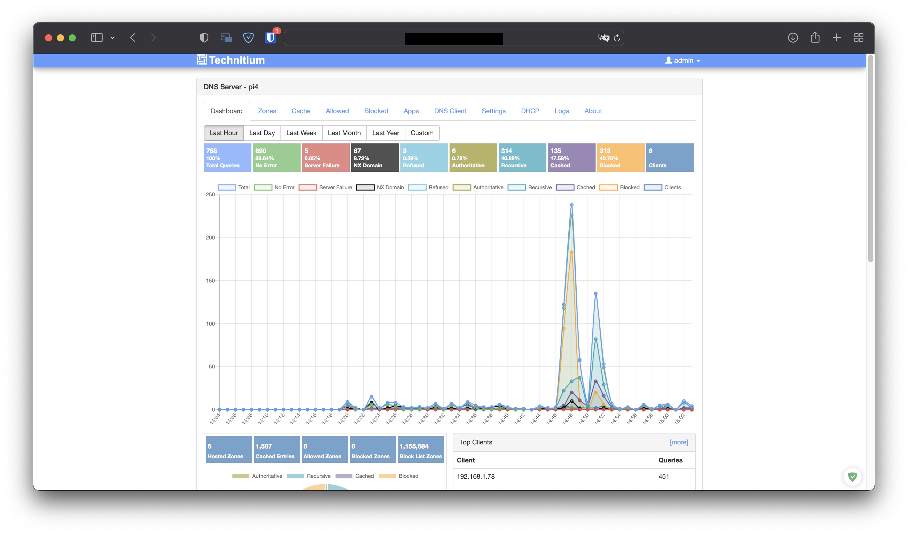

<!--
N.B.: This README was automatically generated by https://github.com/YunoHost/apps/tree/master/tools/readme_generator
It shall NOT be edited by hand.
-->

# Technitium DNS pour YunoHost

[](https://dash.yunohost.org/appci/app/technitium-dns)  

[](https://install-app.yunohost.org/?app=technitium-dns)

*[Read this readme in english.](./README.md)*

> *Ce package vous permet d’installer Technitium DNS rapidement et simplement sur un serveur YunoHost.
Si vous n’avez pas YunoHost, regardez [ici](https://yunohost.org/#/install) pour savoir comment l’installer et en profiter.*

## Vue d’ensemble

Technitium DNS Server is an open source tool that can be used for blocking Internet Ads using DNS Sinkhole, self hosting a local DNS server for privacy & security or, used for experimentation/testing by software developers on their computer.

### Features

- Block ads & malware using one or more block list URLs.
- High performance DNS server based on async IO that can serve millions of requests per minute even on a commodity desktop PC hardware (load tested on Intel i7-8700 CPU with more than 100,000 request/second over Gigabit Ethernet).
- Self host DNS-over-TLS and DNS-over-HTTPS DNS service on your network.
- Use public DNS resolvers like Cloudflare, Google & Quad9 with DNS-over-TLS and DNS-over-HTTPS protocols as forwarders.
- Advanced caching with features like serve stale, prefetching and auto prefetching.
- Supports working as an authoritative as well as a recursive DNS server.
- DNSSEC validation support with RSA & ECDSA algorithms for recursive resolver, forwarders, and conditional forwarders.
- DNSSEC support for all supported DNS transport protocols including encrypted DNS protocols (DoT, DoH, & DoH JSON).
- CNAME cloaking feature to block domain names that resolve to CNAME which are blocked.
- Self host your domain names on your own DNS server.
- Wildcard sub domain support.

... and much more!

**Version incluse :** 12.0.1~ynh1

## Captures d’écran



## Documentations et ressources

- Site officiel de l’app : <https://technitium.com/dns/>
- Documentation officielle utilisateur : <https://technitium.com/dns/help.html>
- Documentation officielle de l’admin : <https://technitium.com/dns/help.html>
- Dépôt de code officiel de l’app : <https://github.com/TechnitiumSoftware/DnsServer>
- YunoHost Store : <https://apps.yunohost.org/app/technitium-dns>
- Signaler un bug : <https://github.com/YunoHost-Apps/technitium-dns_ynh/issues>

## Informations pour les développeurs

Merci de faire vos pull request sur la [branche testing](https://github.com/YunoHost-Apps/technitium-dns_ynh/tree/testing).

Pour essayer la branche testing, procédez comme suit.

``` bash
sudo yunohost app install https://github.com/YunoHost-Apps/technitium-dns_ynh/tree/testing --debug
ou
sudo yunohost app upgrade technitium-dns -u https://github.com/YunoHost-Apps/technitium-dns_ynh/tree/testing --debug
```

**Plus d’infos sur le packaging d’applications :** <https://yunohost.org/packaging_apps>
