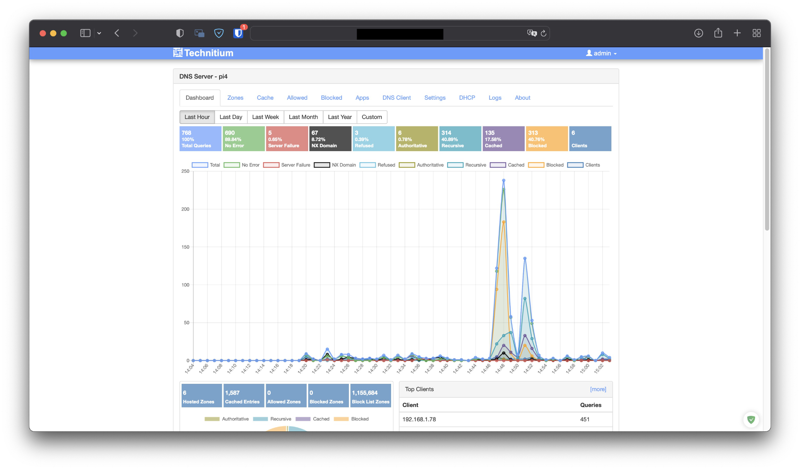

<!--
NOTA: Este README foi creado automáticamente por <https://github.com/YunoHost/apps/tree/master/tools/readme_generator>
NON debe editarse manualmente.
-->

# Technitium DNS para YunoHost

[](https://ci-apps.yunohost.org/ci/apps/technitium-dns/)


[](https://install-app.yunohost.org/?app=technitium-dns)

*[Le este README en outros idiomas.](./ALL_README.md)*

> *Este paquete permíteche instalar Technitium DNS de xeito rápido e doado nun servidor YunoHost.*  
> *Se non usas YunoHost, le a [documentación](https://yunohost.org/install) para saber como instalalo.*

## Vista xeral

Technitium DNS Server is an open source tool that can be used for blocking Internet Ads using DNS Sinkhole, self hosting a local DNS server for privacy & security or, used for experimentation/testing by software developers on their computer.

### Features

- Block ads & malware using one or more block list URLs.
- High performance DNS server based on async IO that can serve millions of requests per minute even on a commodity desktop PC hardware (load tested on Intel i7-8700 CPU with more than 100,000 request/second over Gigabit Ethernet).
- Self host DNS-over-TLS and DNS-over-HTTPS DNS service on your network.
- Use public DNS resolvers like Cloudflare, Google & Quad9 with DNS-over-TLS and DNS-over-HTTPS protocols as forwarders.
- Advanced caching with features like serve stale, prefetching and auto prefetching.
- Supports working as an authoritative as well as a recursive DNS server.
- DNSSEC validation support with RSA & ECDSA algorithms for recursive resolver, forwarders, and conditional forwarders.
- DNSSEC support for all supported DNS transport protocols including encrypted DNS protocols (DoT, DoH, & DoH JSON).
- CNAME cloaking feature to block domain names that resolve to CNAME which are blocked.
- Self host your domain names on your own DNS server.
- Wildcard sub domain support.


**Versión proporcionada:** 13.4~ynh1

## Capturas de pantalla



## Documentación e recursos

- Web oficial da app: <https://technitium.com/dns/>
- Documentación oficial para usuarias: <https://technitium.com/dns/help.html>
- Documentación oficial para admin: <https://technitium.com/dns/help.html>
- Repositorio de orixe do código: <https://github.com/TechnitiumSoftware/DnsServer>
- Tenda YunoHost: <https://apps.yunohost.org/app/technitium-dns>
- Informar dun problema: <https://github.com/YunoHost-Apps/technitium-dns_ynh/issues>

## Info de desenvolvemento

Envía a túa colaboración á [rama `testing`](https://github.com/YunoHost-Apps/technitium-dns_ynh/tree/testing).

Para probar a rama `testing`, procede deste xeito:

```bash
sudo yunohost app install https://github.com/YunoHost-Apps/technitium-dns_ynh/tree/testing --debug
ou
sudo yunohost app upgrade technitium-dns -u https://github.com/YunoHost-Apps/technitium-dns_ynh/tree/testing --debug
```

**Máis info sobre o empaquetado da app:** <https://yunohost.org/packaging_apps>
